# VHDL CPU

A CPU designed in VHDL that supports 16-bit instructions and uses structural components.

## Description

The requirement for this project was to design a simple processor that can support seven different instructions comprised of 2 different formats, support 256 half words of RAM, and have eight registers. The components utilizing memory using arrays are implemented behaviorally, while the rest are implemented structurally using logic gates with 10ns of delay. The processor supports programs up to 255 instructions long using read-only memory.

## Components

### Gates

In order to ensure all the main components have the correct timings, a series of gate components were created. The basic gates used are the 2-bit AND, NOR, OR, XOR, and 1-bit NOT gates. The architecture for these components was implemented behaviorally. The larger utility gates, such as the 4-bit AND and OR gates and the 16-bit OR and NOR gates, were built from these gates.

### Adders

#### 1. Half Adder

The half adder was implemented using an AND gate and an XOR gate where the AND gate calculates the carry out bit, and the XOR gate calculates the sum.

    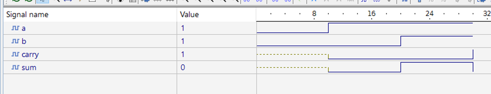 

#### 2. Full Adder

The full adder was created by using two half adders and a 2-bit OR gate. The sum from the first half adder is used as an input for the second half adder, then the carry from both half adders is used in the OR gate to determine the final carry value.

    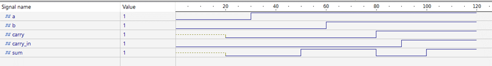 

#### 3. 16-bit Adder

The 16-bit adder was implemented using a ripple-carry design where each full adder feeds the next one. The ripple-carry adder is relatively slow compared to implementations such as the carry-lookahead adder; however, it is more straightforward. In signed addition, the overflow can be detected by XORing the highest 2 carries.

    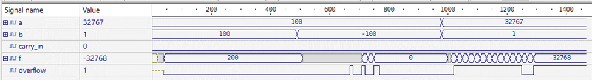 

#### 4. 16-bit Subtractor

The 16-bit subtractor was implemented by taking advantage of the fact that subtraction is just adding a negative number to a positive number. This allows the subtractor to convert the second operand using the two’s complement and forwarding them to the 16-bit adder.

    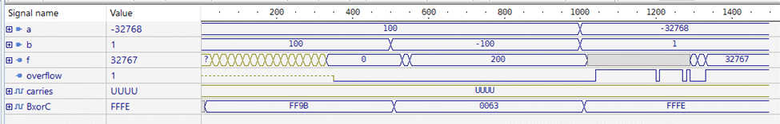 

### 16-bit Multiplier

In a traditional 16-bit array multiplier, the output would be 32 bits wide. Since our multiplier is only required to output the lower 16 bits, we can reduce the size of the multiplier to less than half the traditional multiplier size. The first step in an array multiplier is calculating all the partial products used throughout the adder layers by ANDing each input bit. Next, the partial products are fed into the adder layers. Each adder layer consists of a single half adder, which will produce an output bit, and the rest are full adders, which will be used for the next layer’s calculations. Because we only need 16 bits, as the layer number increases, the number of full adders decreases until we reach a layer with only a half adder, reducing the overall time required to finish the calculation. This multiplier implementation takes 580ns, while the traditional calculation time is 1280ns.

    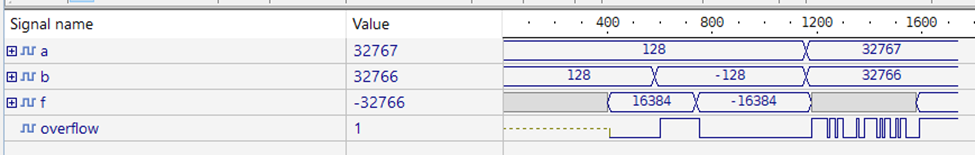 

### 16-bit Multiplexer

#### ALU Multiplexer

The 16-bit multiplexer was an exception to the structural architecture rule for this project. It was allowed to be built behaviorally and operates ideally. The multiplexer takes the two operands, addition, subtraction, and multiplication results, and a 3-bit select as inputs. Based on the different select values, the multiplexer can either output one of the operands or the result from one of the ALU operations.

    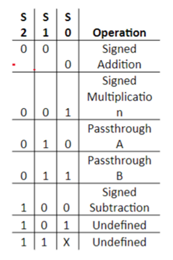 

    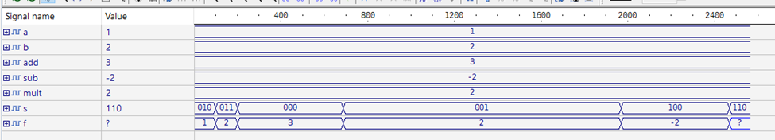 

#### CPU Multiplexers

The processor itself makes use of two more 16-bit multiplexers. The difference between these multiplexers and the one used in the ALU is these only require one select bit. The select bit for these multiplexers are the regDst and memToReg signals provided by the instruction decoder.

    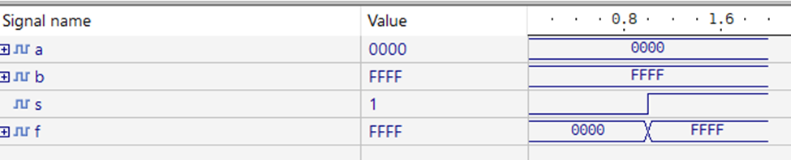 

### 16-bit ALU

The 16-bit ALU is a simple design that encloses all the other components. The ALU simultaneously calculates the addition, subtraction, and multiplication of the operands and sends the results to the multiplexer. Once the calculations have finished, the overflow is determined by checking which operation is being performed and propagating the correct operation’s overflow value. The zero-status bit is checked by NORing all of the output bits; the negative-status bit is just a propagation of the highest output bit.

    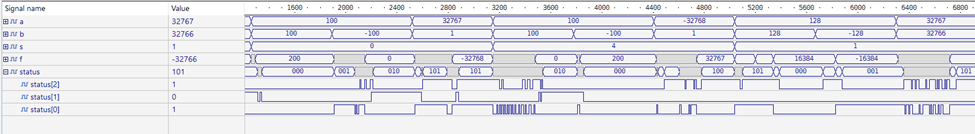 

### Instruction Memory

The instruction memory unit is an array of read-only memory units, each one 16-bits wide. The job of the instruction memory unit is to store the program’s code so it can be retrieved later by a specific address. In the processor, the program counter is incremented each clock cycle, and this counter is used as the address for the instruction memory.

    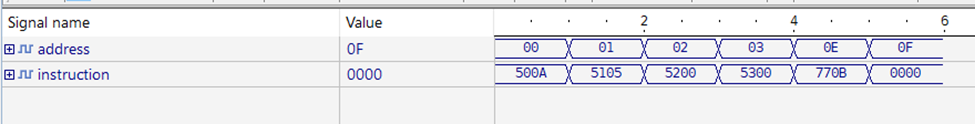 

### Sign Extender

The sign extender is a utility component used for I-type instructions because the immediate value is only 8 bits wide, but 16 bits are required to store values into memory.

    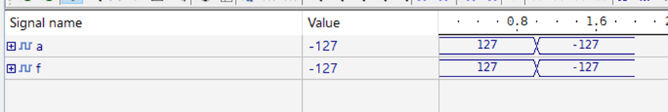 

### 4-bit Multiplexer

The 4-bit multiplexer is a component used by the processor in order to determine which input should be used for the register file input a. If the instruction decoder sets the regMem signal high, bits 11-8 of the instruction are used, but if low bits 7-4 are used. This allows the sh instruction to store the value in a register into a specified address in the RAM.

    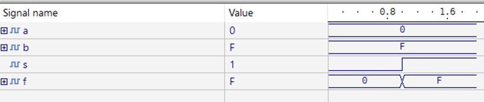 

### Instruction Decoder

The purpose of the instruction decoder is to receive instructions from the instruction memory and convert the opcode bits into various signals used throughout the processor. The signals consist of aluOp to control the ALU, regDst to control register write-backs, regMem for controlling register input, regWrite for telling the register file to store data, memWrite for telling the RAM to store data, and memToReg for controlling the final output from the ALU and RAM.  
The signals are the same for all R-type instructions (opcodes 000, 001, 010, 011, and 100); the only difference is the aluOp signal, which matches the opcode value. For the various I-type instructions, the aluOp is static because it is not in use, but the other signals can change depending on what is required for that particular instruction.

    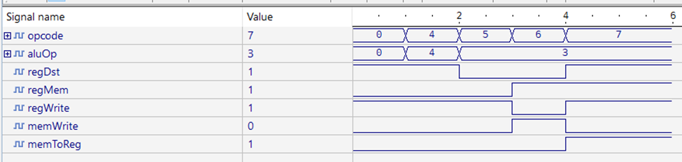 

### Register File

The register file is another component that stores memory in arrays. The project specified that the register file should contain eight registers, each 16 bits wide. Because it is possible to write data to the registers, it must be controlled by the clock to ensure that the written data is correct before storing it.

    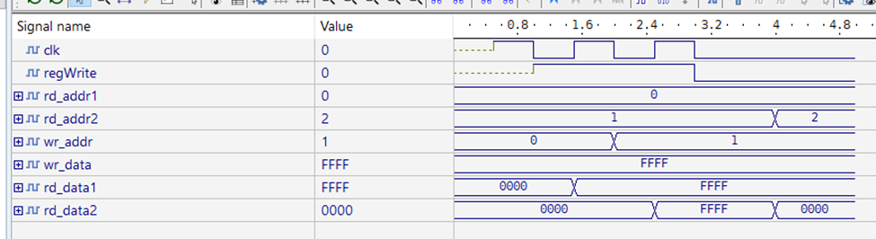 

### RAM

The RAM is the same as the register file, except it can hold 256 half-words instead of only eight. A clock signal also controls it and uses a control signal for writing. One difference is that the RAM can only be accessed by an instruction’s bits 7 through 0, whereas the register file can switch one of its inputs depending on the instruction type.

    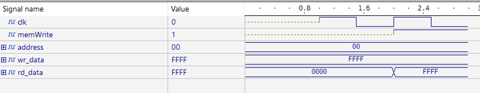 

### CPU

The CPU is the final component and combines all the parts to execute programs. It receives a clock signal from an outside source, which increments the program counter and sends it to the instruction memory. After the instruction memory fetches the new instruction, the CPU sends various parts of the instruction to the different components. Bits 14-12 are sent to the instruction decoder to generate the required signals. Bits 7-4 and 11-8 get sent to a multiplexer controlled by the regMem signal, which outputs to the register file’s a input. Bits 7-0 are sent to the RAM as the input address and to the sign extender for the register file’s write data. The register file has two outputs: one is fed into the write data of the RAM and input a of the ALU, and the second is fed into the b input of the ALU. Finally, the output from the ALU and RAM are multiplexed with the memToReg signal to determine the final output of the system.

    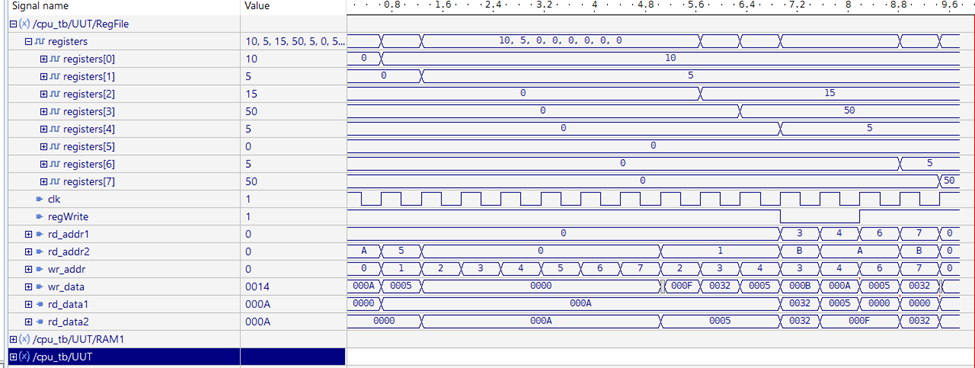 

